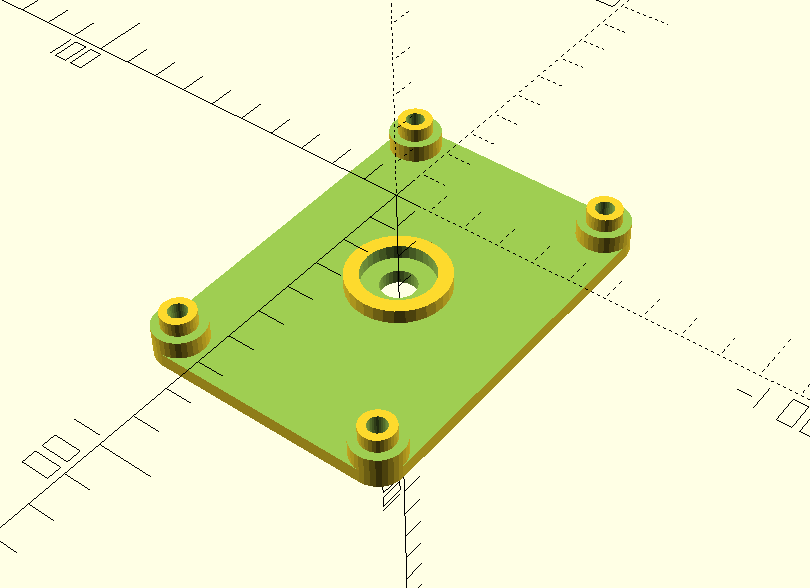

# Wind Generator Base

Parameterized base for a [Savonius & Gorlov VAWT](https://www.thingiverse.com/thing:16504). You need to at least adjust the size of the motor and gears to your needs using openscad.

# Thingiverse
The model is also hosted on thingiverse and can be remised there as well:
[Parameterized base for a Savonius & Gorlov VAWT](https://www.thingiverse.com/thing:5667879)
